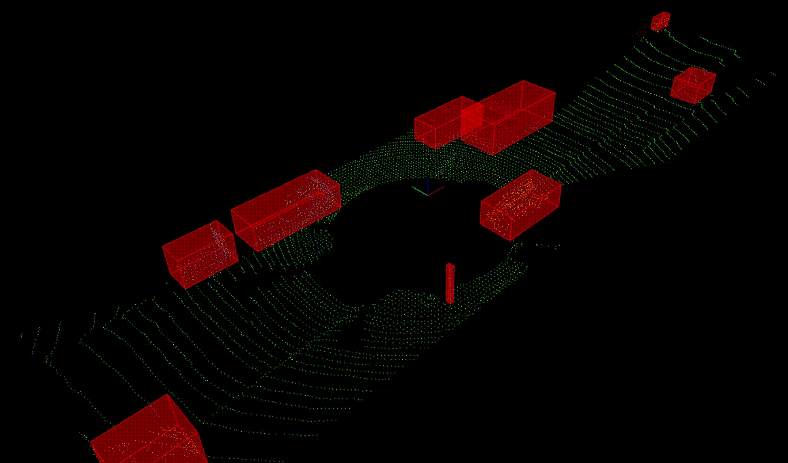

# Проект "Lidar Obstacle Detection" (Обнаружение препятствий с помощью лидара)

Проект выполнен в рамках моего обучения на программе UDACITY Self-Driving Car Engineer (модуль Sensor Fusion). На этом курсе я изучала распознавание объектов с помощью датчиков лидара, радара и камеры.  

В проекте **Lidar Obstacle Detection** написана программа для обнаружения препятствий с использованием лидара.  
Я обработала несколько файлов с облаками точек в формате PCD, полученных с лидарного датчика, и обнаружила автомобили и другие препятствия на городской улице.  
В проекте использовалась библиотека Point Cloud Library (PCL).  
Фильтрация облака точек произведена с помощью сетки вокселей **Voxel Grid** и метода **CropBox** по **ROI based filtering**.  
Для сегментации облака точек я использовала алгоритм **3D RANSAC segmentation**.  
Для кластеризации использовала евклидову кластеризацию на KD-дереве **Euclidean clustering based on KD-Tree** и метод ограничивающих рамок **bounding boxes**.  


## I. Ход выполнения проекта

### Лидар и облака точек

1. Создаем указатель на объект `Lidar` в куче, используя два параметра: `std::vector<Car>` и `setGroundSlope`. Метод `Lidar::scan()` выполняет преобразование лучей и возвращает объект-указатель на облако точек `pcl::PointCloud<pcl::PointXYZ>::Ptr`. Вызываем `renderRays()` для просмотра лучей на визуализаторе.


2. Увеличим разрешение лидара, изменив конструктор класса `Lidar` : `numLayers`, `horizontalAngleInc`. Установим `minDistance` на 5 метров, чтобы удалить точки с крыши автомобиля. Установим `sderr` на 0.2 чтобы добавить некоторые шумы в PCD.


3. Удаляем рендеринг сцены шоссе и лучей, включаем рендеринг облака точек с помощью `renderPointCloud()`.


### Сегментация облака точек

1. В `processPointCloud.cpp`, чтобы реализовать метод `ProcessPointClouds::SegmentPlane()` , используем `pcl::SACSegmentation<PointT>` для сегментирования плоского компонента из облака входных точек. Затем, чтобы реализовать `SeparateClouds()`, используем `pcl::ExtractIndices<PointT>` для выделения точек, не принадлежащих плоскости, в качестве препятствий.

2. В `environment.cpp`, создаем `ProcessPointClouds<pcl::PointXYZ>` , вызываем `SegmentPlane()` чтобы разделить плоскость и препятствие. Теперь можно визуализировать облака точек плоскости и препятствия.


### Детектирование различных препятствий с помощью евклидовой кластеризации с помощью PCL

1. В `processPointCloud.cpp`, чтобы реализовать метод `ProcessPointClouds::Clustering()` , создаем KD-дерево  `pcl::search::KdTree<PointT>::Ptr` для входного облака точек, настраиваем параметры для объекта евклидовой кластеризации `pcl::EuclideanClusterExtraction<PointT>` и извлекаем кластеры из облака точек. В `environment.cpp`, вызываем функцию кластеризации для облака сегментированных точек препятствий, чтобы отобразить кластеризованное препятствие разными цветами.


### Ограничивающие рамки

1. Как только кластеры облаков точек найдены, можно добавить ограничивающие рамки вокруг кластеров. Выделенные области следует рассматривать как область / объект, въезд в который запрещен нашему автомобилю, иначе это приведет к столкновению. Вызываем метод `ProcessPointClouds::BoundingBox()`, который находит значения max и min точек в качестве граничных значений для структуры `Box` . Затем отрисовываем структуру `Box` для каждого кластера.


### Загрузка реальных PCD

1. Создаем новое облако точек из `cityBlock`, код аналогичен функции `simpleHighway`. Тип точек `pcl::PointXYZI` где `I` индикатор интенсивности. Файлы с реальными PCD находятся в папке `src/sensors/data/pcd/data_1/` 


### Фильтрация с PCL

1. Для реализации `ProcessPointClouds::FilterCloud()` в `processPointClouds.cpp`, `pcl::VoxelGrid<PointT>` используем **Voxel Grid** фильтрацию, для класса `pcl::CropBox<PointT>` применяется фильтрация по методу **ROI-based** . Класс `Eigen::Vector4f` имеет четыре параметра - координаты `x`, `y`, `z` и последний, равный 1.0. Нас интересует достаточное расстояние впереди или сзади автомобиля и рядом с автомобилем. Данные об облаке точек за пределами ROI следует удалить, включая точки на крыше.

2. В `environment.cpp`, вызываем функцию `ProcessPointClouds::FilterCloud()` в `cityBlock()`. Вводим размер листа 0.2м, чтобы размер вокселя был достаточно большим для ускорения обработки, но не настолько большим, чтобы сохранялось определение объекта.


### Обнаружение препятствий с помощью реальных данных

1. Получив отфильтрованный PCD, мы можем использовать те же методы сегментации и кластеризации, использованные ранее в `cityBlock()`

2. Настраиваем `Eigen::Vector4f minPoint/maxPoint` для `ProcessPointClouds::FilterCloud()` и `int minSize/maxSize` для `ProcessPointClouds::Clustering()`


### Поток PCD

1. Создаем вектор `stream` для хранения путей к файлам PCD в хронологическом порядке. Вызываем функцию `cityBlock()` , которая обрабатывает облако входных точек из внешнего источника. В функции `main()` из `environment.cpp`, в цикле загрузим PCD-файл, обработаем его и обновим визуализатор.




### Обнаружение препятствий с помощью лидара

1. Создаем функцию `ProcessPointClouds::SegmentPlaneRansac()` в `processPointClouds.cpp`, которая использует 3D RANSAC сегментацию. И вызываем эту функцию сегментации для `cityBlock()` из `environment.cpp`

2. Создаем `ProcessPointClouds::ClusteringEuclidean` и вспомогательную функцию к ней `ProcessPointClouds::clusterHelper` в `processPointClouds.cpp`, которая использует евклидову кластеризацию с KD-деревом. Вызываем эту функцию кластеризации для `cityBlock()` из `environment.cpp`

3. Перед созданием проекта нужно убедиться, что макрос `CUSTOM_METHOD` определен в `environment.cpp`, чтобы использовались пользовательские реализации на шагах 1 и 2. В противном случае при определении макроса `PCL_METHOD` будут использоваться функции сегментации и кластеризации, предоставляемые библиотекой PCL.


## II. Подготовка и запуск проекта на Ubuntu

Для этого проекта требуется установка Point Cloud Library (PCL).

```bash
$ sudo apt install libpcl-dev
```

Структура проекта:
- src
    * quiz
        * cluster
            + `cluster.cpp`: функции для евклидовой кластеризации
            + `kdtree.h`: структура KD-tree
        * ransac
            + `ransac2d.cpp`: функции для кластеризации RANSAC
    * render
        + `box.h`: структура для определения объектов
        + `render.h`, `render.cpp`: классы и методы для рендеринга объектов
    * sensors
        + `lidar.h`: функции, использующие преобразование лучей для создания PCD
    * `environment.cpp`: основной файл для использования PCL и обработки / визуализации PCD
    * `processPointClouds.h`, `processPointClouds.cpp`: функции для фильтрации, сегментации, кластеризации, упаковки, загрузки и сохранения PCD

Сборка и запуск проекта. Должно появиться окно с имитацией дорожной обстановки.
```bash
$ cd Lidar_Obstacle_Detection
$ mkdir build && cd build
$ cmake ..
$ make
$ ./environment
```

## III. Ссылки

`pcl::PointXYZ`: https://pointclouds.org/documentation/structpcl_1_1_point_x_y_z.html

Пример сегментирования плоскости с помощью PCL: https://pointclouds.org/documentation/tutorials/extract_indices.html

Пример евклидовой кластеризации: https://pointclouds.org/documentation/tutorials/cluster_extraction.html

Пример Voxel Grid фильтрации: https://pointclouds.org/documentation/tutorials/voxel_grid.html

Пример Crop Box фильтрации: https://pointclouds.org/documentation/classpcl_1_1_crop_box.html